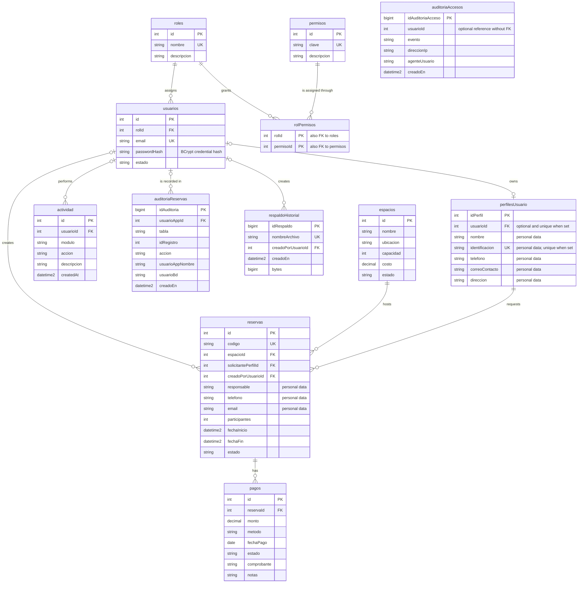

# Data Architecture & Persistence Layer

El sistema persiste sus datos en una base relacional SQL Server con 12 tablas, vistas de consulta y procedimientos almacenados. El backend accede a ese esquema mediante JDBC y `JdbcTemplate`; no utiliza entidades ORM.

## Database Configuration

| Service/Module | DB Type | Profile | Driver | Connection | Migration Tool |
|---|---|---|---|---|---|
| `backend` | Microsoft SQL Server 2025 | `default` (`application.properties`); no hay perfiles de base de datos adicionales | Microsoft JDBC Driver for SQL Server | `jdbc:sqlserver://localhost:1433;databaseName=reservasScouts;encrypt=true;trustServerCertificate=true`; Spring Boot usa HikariCP con valores predeterminados, sin tamaño de pool personalizado | No se usa Flyway ni Liquibase. La instalación inicial y las actualizaciones se mantienen como scripts T-SQL versionados en `db/`; no hay generación automática del esquema desde Java |

El script `db/reservasScouts.sql` es la fuente de instalación inicial; `db/migrations/001_cumplimiento.sql` actualiza una base existente. No se detectó una base distinta configurada para pruebas ni archivos de seed separados: los datos iniciales están en el script de instalación. La contraseña se proporciona desde el entorno y no se documenta aquí. `trustServerCertificate=true` es una configuración local de desarrollo; una conexión de producción debe validar el certificado TLS.

## Data Ownership per Service

| Service | Tables Owned | ORM Framework | Caching | Notes |
|---|---|---|---|---|
| `backend` | `usuarios`, `roles`, `permisos`, `rolPermisos`, `perfilesUsuario`, `espacios`, `reservas`, `pagos`, `actividad`, `auditoriaReservas`, `auditoriaAccesos`, `respaldoHistorial` | Ninguno; repositorios JDBC propios llaman procedimientos almacenados mediante `JdbcTemplate` | Ninguno detectado | Único servicio con persistencia; las vistas y procedimientos SQL forman parte de la misma base `reservasScouts` |

La base activa consultada contiene 12 tablas: las 11 tablas funcionales y `respaldoHistorial`, añadido para registrar metadatos de copias.

## Entity Model

Los modelos Java son records de dominio o proyección, no entidades persistentes con anotaciones JPA. Entre los principales se encuentran `Usuario` (`backend/src/main/java/com/reservasscouts/backend/model/Usuario.java`), `Perfil` (`backend/src/main/java/com/reservasscouts/backend/model/Perfil.java`), `Espacio` (`backend/src/main/java/com/reservasscouts/backend/model/Espacio.java`), `Reserva` y `ReservaResumen` (`backend/src/main/java/com/reservasscouts/backend/model/Reserva.java`, `backend/src/main/java/com/reservasscouts/backend/model/ReservaResumen.java`), `Pago` (`backend/src/main/java/com/reservasscouts/backend/model/Pago.java`), `Rol` (`backend/src/main/java/com/reservasscouts/backend/model/Rol.java`), `UsuarioLogin` (`backend/src/main/java/com/reservasscouts/backend/model/UsuarioLogin.java`), `AuditoriaResumen` (`backend/src/main/java/com/reservasscouts/backend/model/AuditoriaResumen.java`) y `RespaldoArchivo` (`backend/src/main/java/com/reservasscouts/backend/model/RespaldoArchivo.java`). Los tipos de salida omiten o proyectan columnas según la operación; por ejemplo, `UsuarioLogin` contiene el hash necesario para verificar credenciales y `Usuario` no lo expone.

Las relaciones persistentes se definen mediante claves foráneas en SQL Server, no con asociaciones Java bidireccionales. No se encontraron anotaciones `@Transactional`; la capa Java no configura una unidad de trabajo ORM ni transacciones declarativas. El esquema SQL también contiene las tablas de permisos y auditoría que no tienen un modelo Java de fila completo.

<!-- mermaid-checked: every attribute is `<type> <name> [<key>] ["<description>"]` with at most one of PK/FK/UK, no \n in descriptions, no {} in descriptions, every relationship label is double-quoted -->

## Key Repository Methods

| Service | Repository | Notable Methods | Purpose |
|---|---|---|---|
| `backend` | `UsuarioRepository` (`backend/src/main/java/com/reservasscouts/backend/repository/UsuarioRepository.java`) | `filtrar(String email, Integer rolId, String estado): List<Usuario>`; `listarRoles(): List<Rol>`; `buscarParaLogin(String email): UsuarioLogin` | Búsqueda con filtros, lectura de roles y obtención del hash de credencial por medio de `paUsuarioFiltrar`, `paRolFiltrar` y `paUsuarioLogin` |
| `backend` | `ReservaRepository` (`backend/src/main/java/com/reservasscouts/backend/repository/ReservaRepository.java`) | `filtrar(String codigo, String responsable, String estado, Integer espacioId, Integer solicitantePerfilId, LocalDate fechaDesde, LocalDate fechaHasta): List<ReservaResumen>`; `buscarPorId(Integer id): Reserva` | Filtros combinables y proyección ligera para listados; usa `paReservaFiltrar` y `paReservaBuscarPorId` |
| `backend` | `PerfilRepository` (`backend/src/main/java/com/reservasscouts/backend/repository/PerfilRepository.java`) | `filtrar(String nombre, String identificacion, String correoContacto, String tipoPerfil, Integer usuarioId): List<Perfil>` | Busca perfiles por criterios y por usuario mediante `paPerfilFiltrar` |
| `backend` | `EspacioRepository` (`backend/src/main/java/com/reservasscouts/backend/repository/EspacioRepository.java`) | `filtrar(String nombre, String ubicacion, String estado, Integer capacidadMinima, BigDecimal costoMaximo): List<Espacio>` | Consulta espacios con filtros de capacidad y costo mediante `paEspacioFiltrar` |
| `backend` | `PagoRepository` (`backend/src/main/java/com/reservasscouts/backend/repository/PagoRepository.java`) | `filtrar(Integer reservaId, String codigoReserva, String metodo, String estado, LocalDate fechaDesde, LocalDate fechaHasta): List<Pago>` | Consulta pagos por reserva, método, estado y rango de fechas mediante `paPagoFiltrar` |
| `backend` | Servicios de auditoría y respaldo (`backend/src/main/java/com/reservasscouts/backend/service/AuditoriaAccesoService.java`, `backend/src/main/java/com/reservasscouts/backend/service/RespaldoService.java`) | `registrar(usuarioId, evento, direccionIp, agenteUsuario)`; `listar()`; `crear(...)`; `restaurar(...)` | Registra eventos y usa procedimientos de SQL Server para consultar el catálogo y registrar metadatos de copias. No representa un repositorio Spring Data |

Las operaciones de inserción, actualización y eliminación de los cinco repositorios JDBC también invocan procedimientos almacenados específicos; no son métodos heredados de una interfaz CRUD.

## Caching Strategy

No se encontraron proveedores de caché, anotaciones Spring Cache, caché de segundo nivel de Hibernate ni uso de Redis/Caffeine/EhCache. Las lecturas se resuelven con consultas/procedimientos SQL en cada operación. La sesión de autenticación reside en el servidor (`HttpSession`); es estado de sesión y no una caché de resultados de consultas. No hay TTL ni política de invalidación de resultados de base de datos configurados.

## Data Ownership Boundaries

`backend` es el único propietario lógico de la base `reservasScouts`; no hay base por servicio ni llamadas de un servicio a los datos de otro servicio. La SPA consume el backend, que usa repositorios JDBC y procedimientos almacenados sobre el esquema compartido. Las vistas (`vReservasResumen`, `vPerfilesConfidencial` y `vAuditoriaResumen`) y los procedimientos almacenados encapsulan proyecciones, filtros y operaciones de datos. La autorización de la aplicación se aplica en el backend por sesión y rol; la cuenta `reservas_app` tiene permiso de ejecución sobre procedimientos almacenados en lugar de permisos directos de lectura/escritura en tablas. `reservas_consulta` no tiene login y solo recibe lectura de dos vistas.

No se observa CQRS ni almacenamiento separado de lectura/escritura: la vista de resumen es una proyección SQL en la misma base operacional. Las operaciones de auditoría y el catálogo de respaldos también se guardan allí. El historial contiene metadatos, mientras que los archivos de respaldo contienen una copia completa de la base. El login de mantenimiento de respaldos tiene `dbcreator` a nivel de instancia, un privilegio amplio que se documenta como exclusivo para desarrollo local.

### Data Classification & Sensitivity

| Entity | Sensitive Fields | Classification (PII/PHI/PCI/None) | Controls in Place |
|---|---|---|---|
| `usuarios` | `email`, `passwordHash` | PII and authentication secret | Contraseña almacenada como hash BCrypt; sesiones HttpOnly y autorización por rol en la aplicación. No se configuró cifrado de base de datos en reposo |
| `perfilesUsuario` | `nombre`, `identificacion`, `telefono`, `correoContacto`, `direccion` | PII | `vPerfilesConfidencial` enmascara teléfono y correo; la vista no enmascara nombre, identificación o dirección. El acceso detallado está restringido por autorización de la aplicación. No se configuró cifrado en reposo |
| `reservas` | `grupo`, `responsable`, `telefono`, `email`, `observaciones`, actividad y fechas | PII; puede referirse a menores | Roles y sesión controlan el acceso en la aplicación; usuarios regulares reciben una proyección resumida. No hay enmascaramiento de todos los campos de contacto ni cifrado en reposo configurado |
| `pagos` | `monto`, `metodo`, `comprobante`, `notas` | Datos financieros; no se detectaron datos de tarjeta PCI | Acceso administrativo en la aplicación. No se detectaron PAN, CVV ni datos de tarjeta; no hay cifrado en reposo configurado |
| `actividad` | `usuarioId`, `descripcion` | Identificadores de usuario y actividad | Registro en base; no se configuró cifrado en reposo |
| `auditoriaReservas` | `usuarioAppId`, `usuarioAppNombre`, cambios registrados | PII limitada y datos de auditoría | Lectura de auditoría restringida a administración en la aplicación; los triggers evitan guardar contraseñas y datos de contacto. No se configuró cifrado en reposo |
| `auditoriaAccesos` | `usuarioId`, `direccionIp`, `agenteUsuario` | Identificadores en línea y datos de auditoría | Lectura restringida a administración en la aplicación; retención y cifrado en reposo no están configurados aquí |
| `respaldoHistorial` | `creadoPorUsuarioId`, `nombreArchivo` y metadatos | Metadatos de auditoría | Registro en base y acceso administrativo en la aplicación. Los archivos `.bak` referenciados contienen todos los datos personales y hashes; dependen de permisos NTFS del servicio SQL Server y no se configuró cifrado del respaldo |
| `espacios` | `ubicacion` | None identificada en el modelo actual | Sin control de campo especial; acceso administrativo para cambios |
| `roles`, `permisos`, `rolPermisos` | Nombres y descripciones de configuración de autorización | None | Solo administración de la aplicación; `reservas_app` opera mediante procedimientos almacenados |

No se detectaron datos médicos (PHI) ni números de tarjeta/códigos de seguridad (PCI) en el esquema actual. La ausencia de cifrado de base de datos y de cifrado de archivos de respaldo en reposo es una limitación explícita; el almacenamiento de datos de scouts puede incluir información de menores y requiere controles adicionales antes de operar fuera del entorno local.
