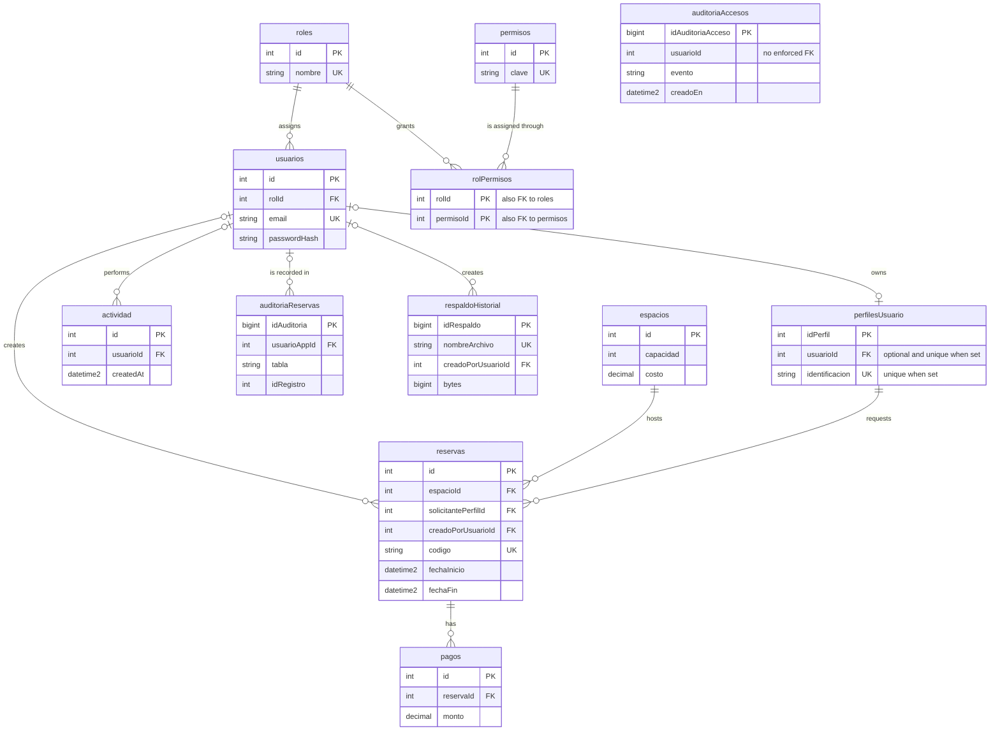

# Diagrama relacional - `reservasScouts`

El diagrama representa las claves primarias y foráneas del esquema activo. `auditoriaAccesos.usuarioId` se conserva como dato de auditoría y no tiene una clave foránea.

<!-- mermaid-checked: every attribute is `<type> <name> [<key>] ["<description>"]` with at most one of PK/FK/UK, no \n in descriptions, no {} in descriptions, every relationship label is double-quoted -->

Consulte el [diccionario de datos](./diccionarioDatos.md) para ver todos los campos, tipos SQL, nulabilidad, claves, valores predeterminados y restricciones.
